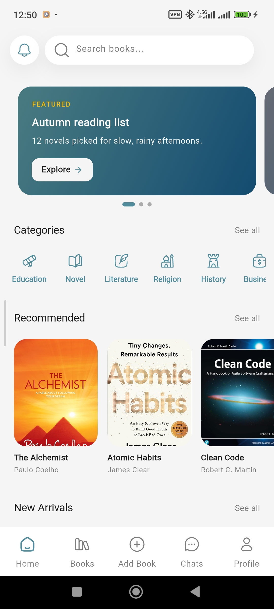
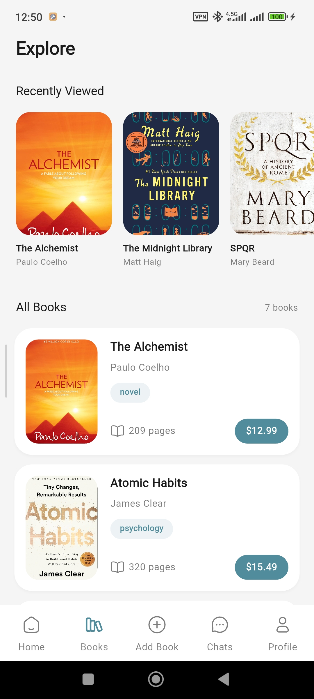

# Ketabto

A Flutter book discovery and recommendation application.

This repository contains selected source code from the Ketabto project, created for portfolio and demonstration purposes.

## ✨ Features

- Book discovery and exploration
- Add Book
- Book categories
- User profile
- Recent books
- Saved books
- Multi-language support (Persian & English)
- Chat

## 🛠 Tech Stack

- Flutter & Dart
- BLoC / Cubit
- Clean Architecture
- Dependency Injection
- REST API
- Hive
- Firebase

  
  
  
  

  
  
  

